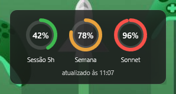
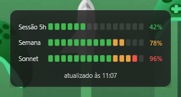

<h1 align="center">🟢 ClaudeWatch</h1>

  <a href="README.md">Português</a> ·
  <b>English</b> ·
  <a href="README.es.md">Español</a>

  <em>Keep an eye on your <b>Claude</b> subscription usage without breaking your flow — 
  a tidy, always-visible widget on your Windows desktop.</em>

  
  
  

  
  &nbsp;&nbsp;
  

The two styles: <b>Rings</b> and <b>LED</b> · 🟢 &lt;70% · 🟠 70–89% · 🔴 ≥90%

**ClaudeWatch** shows, in real time and at a glance, how much of your Claude limits you've used:

- ⏱️ **5-hour session**
- 📅 **Weekly**
- 🧠 **Weekly Sonnet**

…in a sleek floating card and a colored icon next to your clock. It reads the credential from the **Claude Code** you already have installed — and **never modifies it**.

## ✨ Features

- 🎨 Two styles: **Rings** and **LED** — switch with one click
- 🔢 Tray icon showing the most critical meter, colored by zone
- 🚦 Color by level: 🟢 green (&lt;70%) · 🟠 amber (70–89%) · 🔴 red (≥90%)
- 📌 Always on top, draggable, with a **locked** mode (click-through, stays out of your way)
- 🪟 Start with Windows (optional)
- 🔔 Notifies you when a new version is available
- 📦 A single `.exe` — no installer, no runtime

## 📥 Install

1. Download `ClaudeWatch.exe` from the **[latest release](https://github.com/carlosdealmeida/claude-watch/releases/latest)**.
2. Double-click it.
3. On first run Windows shows a blue **SmartScreen** warning because the app is unsigned → click **"More info" → "Run anyway"**.

> 💡 Windows 11 hides new icons under the `^` arrow near the clock. Drag the ClaudeWatch icon out to keep it visible.

**Requirements:** Windows 10 or 11 · **Claude Code** installed and logged in (`claude` in the terminal).

## 🖱️ How to use

- **Double-click** the icon: show/hide the widget
- **Right-click** the icon opens the menu:
  - *Show/hide widget* · *Lock widget* · *Style: Rings / LED*
  - *Refresh now* · *Start with Windows* · *Exit*
- **Drag** the card while unlocked — its position is remembered

## 🚦 States

- **Grayed out + "⚠ updated at HH:mm"** — no internet or API down; showing the last known data.
- **🔒 "Log in to Claude Code"** — no valid credential; log in (`claude`) and the widget recovers on its own.

## 🔒 Privacy & security

- It **reads** Claude Code's `.credentials.json` but **never writes** to it — an absolute invariant.
- It uses the **same API** as Claude Code's `/usage` command.
- The token cache is protected by **DPAPI** (per-user Windows encryption).
- **No telemetry**: nothing goes to third parties — only the call to Anthropic's API.

## ⚠️ Limitations & disclaimer

ClaudeWatch is an **unofficial** project and is **not affiliated with Anthropic**. It relies on Claude Code's credential and API, so:

- It may **stop working** if Anthropic changes the API (without notice).
- Use it **personally and in moderation** — very frequent requests may be rate-limited (HTTP 429).
- Use it **at your own risk**.

## 🔄 Updates

Every few hours the app checks for a new version and notifies you via the tray icon, a Windows balloon, and a footer in the widget itself — just click to open the download page.

## 🗂️ Files & uninstall

- Settings: `%AppData%\ClaudeWatch\settings.json` · Logs: `%AppData%\ClaudeWatch\logs\`
- To remove: exit via the menu (*Exit*), uncheck *Start with Windows*, then delete the `.exe` along with the `%AppData%\ClaudeWatch` folder.

## 🛠️ For developers

Built with **.NET 10 + WPF**. Build with `dotnet build ClaudeWatch.slnx` and run the tests with `dotnet test ClaudeWatch.slnx`.

---

Personal, non-commercial project. Claude and Anthropic are trademarks of Anthropic — this project is not affiliated with or endorsed by them.

